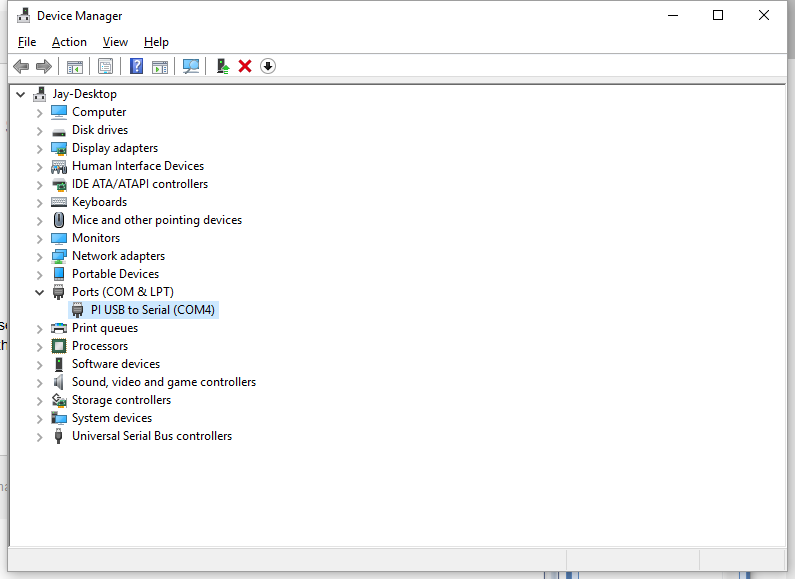

# Project description
Python library and a small recording script for the [Digipass DWL5500XY inclinometer](https://www.digipas.com/product/precision-measurement/2-axis-inclination-sensor-module/dwl-5500xy.php). 
The implementation follows what was specified in the [instruction manual](https://www.digipas.com/documents/DWL-5x000%20Instruction%20Manual-rev.2.4.12.pdf). 

# Installation
> [!IMPORTANT]
> Both the libraries `serial` and `pyserial` can be imported as `import serial`. This module expects a `pyserial` installation, and will not work with the incorrect library!
```sh
git clone https://github.com/missing-user/DWL5500XY-Python/.git
cd DWL5500XY-Python
pip install -r requirements.txt
```

# Usage
See the test.py for example code, most features are explored here.

1. Initialize the sensor, the boolean argument controls wether received values are printed to the terminal.
```python
import DWL5500XY
sc = DWL5500XY.TiltSensor(True)
```
2. Open the serial connection. On Windows you can find the port by opening `Windows Key > Device Manager > COM Devices` and identifying the COM port that appears when plugging in the USB to serial converter of your sensor. On Linux, you can list connected serial devices using `ls /sys/class/tty/ttyUSB*`. Replace the port name in the code by the one you identified.

```python
import os
if os.name == 'nt':
  sc.open_connection("COM5") # Windows style serial port
else:
  sc.open_connection('/dev/ttyUSB0') # Linux style serial port
```
3. 

> [!CAUTION]
> ***Calling the calibration function will overwrite the factory settings!***
>
> If you have purchased a new DWL5500XY sensor, i suggest to **NOT PERFORM A NEW CALIBRATION**! The sensor should be calibrated at the factory, and will most probably be better than what you can achieve, unless you really know what you're doing. You have been warned.
